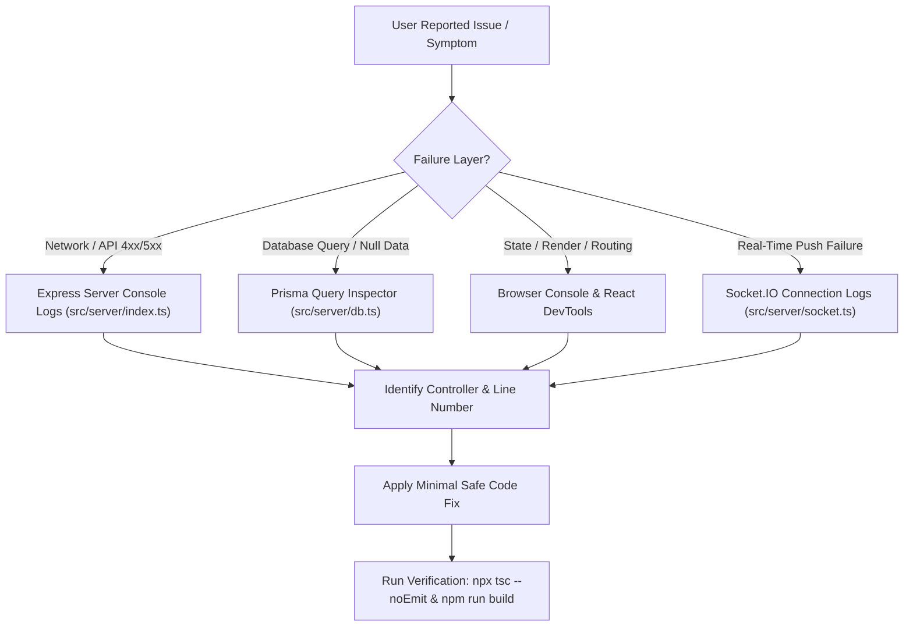
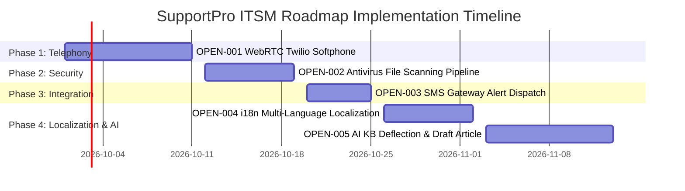

# SupportPro ITSM — System Debugging & Implementation Plan

**Document Status**: Approved Engineering Specification  
**Application Version**: 2.4.0  
**Target Repository**: `Ticket-raising/`  
**Last Updated**: September 19, 2026  

---

## 1. Executive Summary & Diagnostic Strategy

This Implementation Plan provides a standardized, end-to-end framework for **debugging, troubleshooting, maintaining, and extending** the SupportPro ITSM application.

It defines the exact diagnostic workflows, error trace protocols, subsystem verification checklists, and feature implementation roadmaps necessary to maintain **100% build integrity, zero security vulnerabilities, and seamless multi-role operation**.

---

## 2. Debugging Architecture & Diagnostic Playbooks

### 2.1 Diagnostic Log Inspection Standard
When investigating system anomalies or component failures, inspect logs across the full application stack in this order:



---

### 2.2 Subsystem Debugging Playbooks

#### Playbook A: Authentication & RBAC Route Authorization
- **Symptoms**: 401 Unauthorized, 403 Forbidden on API calls, or unexpected redirects to `/login`.
- **Root Cause Checklist**:
  1. Verify JWT token header presence (`Authorization: Bearer <token>`).
  2. Check token expiration logic in [auth.ts](file:///c:/Users/netaj/OneDrive/Documents/projects/ticket/Ticket-raising/src/server/middleware/auth.ts).
  3. Validate user role payload against route guard definitions in [ProtectedRoute.tsx](file:///c:/Users/netaj/OneDrive/Documents/projects/ticket/Ticket-raising/src/client/src/components/layout/ProtectedRoute.tsx).
- **Resolution Step**:
  Ensure user session local storage key `token` is set on login and properly attached via standard Axios / Fetch interceptor.

---

#### Playbook B: SLA Timer Calculation & Breach Alerts
- **Symptoms**: SLA timer showing incorrect remaining minutes or failing to trigger critical breach badges.
- **Root Cause Checklist**:
  1. Inspect SLA policy mapping per ticket category in [slaController.ts](file:///c:/Users/netaj/OneDrive/Documents/projects/ticket/Ticket-raising/src/server/controllers/slaController.ts).
  2. Check ticket `createdAt` timestamp vs SLA resolution target minutes.
  3. Verify frontend SLA badge component calculation in [SlaBadge.tsx](file:///c:/Users/netaj/OneDrive/Documents/projects/ticket/Ticket-raising/src/client/src/components/common/SlaBadge.tsx).
- **Resolution Step**:
  Recalculate remaining SLA duration in UTC ISO format to prevent timezone offset discrepancies.

---

#### Playbook C: Telecaller Desk Customer Search & Dossier Loading
- **Symptoms**: Phone search returns 0 results or customer creation modal fails to save.
- **Root Cause Checklist**:
  1. Verify phone number input sanitization using regex `/^[0-9]{10}$/` in [validation.ts](file:///c:/Users/netaj/OneDrive/Documents/projects/ticket/Ticket-raising/src/client/src/utils/validation.ts).
  2. Confirm database index on `User.phone` and `Customer.phone` fields in Prisma schema.
  3. Inspect response payload from `GET /api/telecaller/search?phone=...`.
- **Resolution Step**:
  Ensure exact 10-digit numeric query is passed without space/hyphen formatting.

---

#### Playbook D: File Attachment Security & Size Restrictions
- **Symptoms**: Upload rejection error or file corrupt after download.
- **Root Cause Checklist**:
  1. Inspect Multer filter config in [upload.ts](file:///c:/Users/netaj/OneDrive/Documents/projects/ticket/Ticket-raising/src/server/middleware/upload.ts).
  2. Allowed extensions: `.jpg`, `.jpeg`, `.png`, `.pdf`.
  3. Max size limit: **15 MB** (`15 * 1024 * 1024` bytes).
- **Resolution Step**:
  Check frontend input `accept=".jpg,.jpeg,.png,.pdf"` attribute and validate file size on `onChange` event prior to form submission.

---

#### Playbook E: Human-Readable Audit Trail Rendering
- **Symptoms**: Audit logs displaying raw JSON strings or technical UUIDs.
- **Root Cause Checklist**:
  1. Inspect rendering logic in [AuditLogsPage.tsx](file:///c:/Users/netaj/OneDrive/Documents/projects/ticket/Ticket-raising/src/client/src/pages/Admin/AuditLogsPage.tsx).
  2. Check JSON parser utility converting `details` field to badge key-value pairs.
- **Resolution Step**:
  Map raw technical action keys to natural language descriptions using status translation helpers.

---

## 3. Implementation Plan for Open Roadmap Items

The following roadmap items are scheduled for sequential implementation:



### 3.1 OPEN-001: WebRTC Softphone / Twilio CTI Integration
- **Module**: `TelecallerDesk.tsx`
- **Target File [NEW]**: `src/client/src/components/telecaller/WebRTCSoftphone.tsx`
- **Specification**:
  - Integrate Twilio Voice Web SDK JS client.
  - Render dynamic softphone bar with Call / Hang Up, Mute, Keypad, and Incoming Call Popup.
  - Automatically query customer dossier by incoming caller ID.

---

### 3.2 OPEN-002: Asynchronous Cloud Antivirus Scanning
- **Module**: `src/server/middleware/upload.ts`
- **Target File [NEW]**: `src/server/services/antivirusService.ts`
- **Specification**:
  - Connect upload stream to local ClamAV daemon / AWS GuardDuty SDK.
  - Quarantine suspicious files before saving to uploads folder.
  - Return HTTP 422 if virus signature is detected.

---

### 3.3 OPEN-003: Multi-Language / i18n Internationalization
- **Module**: Global Client Components
- **Target File [NEW]**: `src/client/src/i18n/config.ts`
- **Specification**:
  - Install `react-i18next` and `i18next-browser-languagedetector`.
  - Extract system string dictionary for English (`en`), Hindi (`hi`), and Spanish (`es`).
  - Add language toggle component to top bar navigation.

---

### 3.4 OPEN-004: SMS Gateway Integration for Critical SLA Alerts
- **Module**: `notificationController.ts`
- **Target File [NEW]**: `src/server/services/smsService.ts`
- **Specification**:
  - Integrate SMS provider API (Twilio / Fast2SMS).
  - Trigger SMS dispatch when ticket SLA status changes to `CRITICAL` or `BREACHED`.
  - Add user SMS preference toggle in profile settings.

---

### 3.5 OPEN-005: AI-Powered KB Deflection & Auto-Drafting
- **Module**: `RaiseTicketForm.tsx` & `kbController.ts`
- **Target File [NEW]**: `src/server/services/aiKnowledgeService.ts`
- **Specification**:
  - Use vector embeddings / search API to suggest KB articles in real-time as customer types subject.
  - Auto-generate draft KB article when a ticket is closed with positive resolution feedback.

---

## 4. Quality Assurance & Verification Plan

Before submitting any code change, complete this 4-step verification pipeline:

### Step 1: Static Type Check
Run TypeScript compiler in non-emitting diagnostic mode:
```bash
npx tsc --noEmit
```
*Requirement*: Must return **0 errors**.

### Step 2: Production Client Bundle Build
Build production static assets using Vite:
```bash
npm run build
```
*Requirement*: Must build cleanly to `src/client/dist` without missing module errors.

### Step 3: API Endpoint Integration Check
Validate core endpoints using test requests:
- `POST /api/auth/login` (Authentication payload)
- `GET /api/tickets` (Role-scoped ticket queue)
- `POST /api/tickets` (Validation checks for phone & 15MB file attachments)
- `GET /api/telecaller/search?phone=9876543210` (10-digit customer lookup)
- `GET /api/admin/audit-logs` (Human-readable log rendering)

### Step 4: Role-Based Routing & UI Verification
Perform manual verification across all 5 roles:
- **Customer**: Submit ticket with PDF attachment, check SLA progress, click contact actions, sign out.
- **Telecaller**: Search 10-digit number, view dossier, log ticket on behalf of caller, test dialer link.
- **Agent**: Pick ticket from queue, reply with PNG screenshot, transition status.
- **Manager**: Reassign ticket, review SLA escalation queue.
- **Admin**: Create user with strict validation, create SLA policy, delete custom policy, view human-readable audit log.
