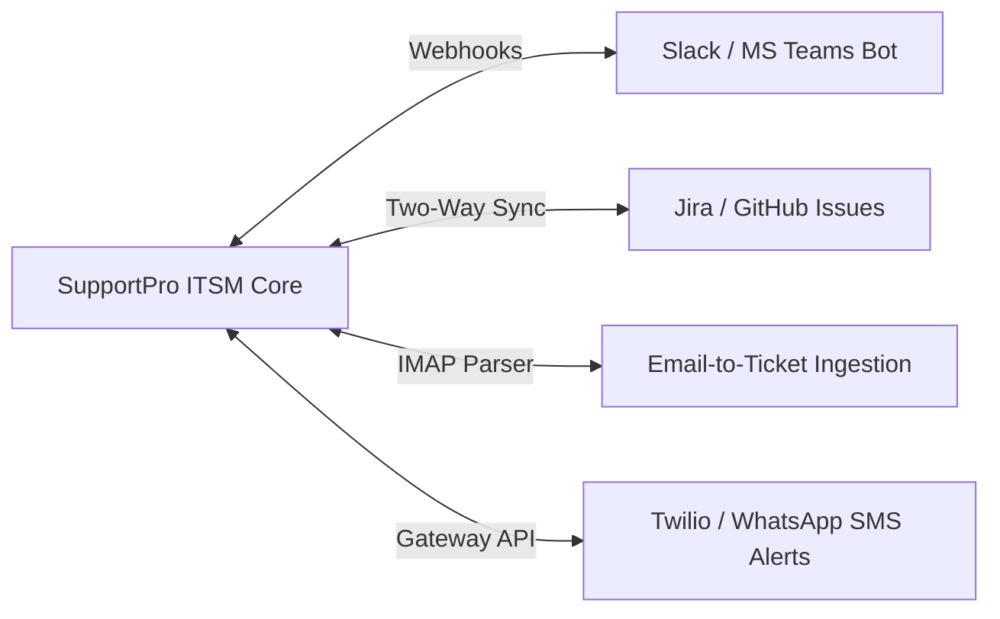
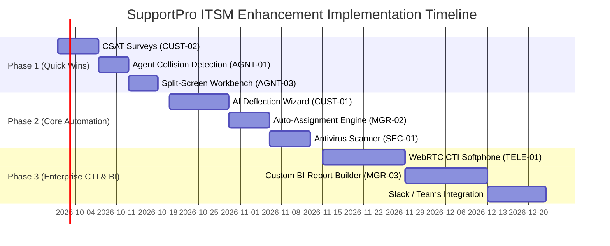

# ResolveHub ITSM — Feature & Architecture Enhancements Catalog
> **powered by HPS(OPC) Pvt. Ltd.**

**Document Status**: Proposal & Future Roadmap  
**Application Version**: 2.4.0  
**Target Application**: ResolveHub Enterprise ITSM (powered by HPS(OPC) Pvt. Ltd.)  
**Last Updated**: September 19, 2026  

---

## Executive Summary

This document details recommended **product, operational, technical, and security enhancements** for the ResolveHub ITSM platform (powered by HPS(OPC) Pvt. Ltd.). These enhancements are prioritized based on business value, ROI, and technical feasibility to take the application from a robust ITSM system to a state-of-the-art enterprise support platform.

---

## 1. Category 1: Customer Experience & Portal Enhancements

| Feature ID | Enhancement Name | Business Impact | Complexity | Target Role |
| :--- | :--- | :--- | :---: | :---: |
| **CUST-01** | **AI-Powered Ticket Deflection Wizard** | Reduces inbound ticket volume by 25–35% by dynamically matching ticket subject with Knowledge Base articles. | Medium | Customer |
| **CUST-02** | **CSAT (Customer Satisfaction) Surveys** | Captures 1–5 star ratings & sentiment tags upon ticket closure to measure agent performance. | Low | Customer / Admin |
| **CUST-03** | **Embeddable Support Web Widget** | Allows customers to check ticket status or start live chat directly from any corporate website without logging into portal. | High | Customer |
| **CUST-04** | **PWA & Offline Ticket Drafts** | Enables offline ticket drafting and sends native mobile push notifications for ticket updates. | Medium | Customer |

---

## 2. Category 2: Telecaller & Rapid Service Desk Enhancements

| Feature ID | Enhancement Name | Business Impact | Complexity | Target Role |
| :--- | :--- | :--- | :---: | :---: |
| **TELE-01** | **WebRTC CTI / In-Browser Softphone** | Enables click-to-dial from `tel:` links and automatic caller dossier popups on incoming calls (Twilio / Asterisk). | High | Telecaller |
| **TELE-02** | **Call Speech-to-Text & Auto-Summary** | Transcribes phone conversations in real-time and auto-populates ticket description fields. | High | Telecaller |
| **TELE-03** | **Rapid Grid Ticket Logging** | Allows telecallers handling bulk phone queries to log tickets in a fast, spreadsheet-style interface. | Medium | Telecaller |

---

## 3. Category 3: Agent Productivity & Collaboration Enhancements

| Feature ID | Enhancement Name | Business Impact | Complexity | Target Role |
| :--- | :--- | :--- | :---: | :---: |
| **AGNT-01** | **Real-Time Agent Collision Detection** | Displays visual banner when multiple agents open or reply to the same ticket simultaneously, preventing duplicate work. | Medium | Agent |
| **AGNT-02** | **AI Co-Pilot & Smart Canned Replies** | Generates context-aware response drafts based on historical ticket resolutions in one click. | Medium | Agent |
| **AGNT-03** | **Split-Screen Ticket Workbench** | Allows agents to view customer history, related KB articles, and reply form side-by-side without context switching. | Low | Agent |

---

## 4. Category 4: Manager & SLA Governance Enhancements

| Feature ID | Enhancement Name | Business Impact | Complexity | Target Role |
| :--- | :--- | :--- | :---: | :---: |
| **MGR-01** | **Predictive SLA Breach Forecasting** | Uses ML regression to flag tickets at risk of SLA breach *before* they breach based on current agent workload and resolution trends. | High | Manager |
| **MGR-02** | **Skill & Load-Based Auto-Assignment** | Automatically routes incoming tickets to available agents based on schedule, department expertise, and active ticket count. | Medium | Manager |
| **MGR-03** | **Custom BI Analytics & Report Builder** | Drag-and-drop dashboard widget generator with exportable PDF/Excel reporting schedules. | High | Manager / Admin |

---

## 5. Category 5: Security, Compliance & System Architecture

| Feature ID | Enhancement Name | Business Impact | Complexity | Target Role |
| :--- | :--- | :--- | :---: | :---: |
| **SEC-01** | **Asynchronous Cloud Antivirus Pipeline** | Scans uploaded JPG, PNG, and PDF attachments via ClamAV / AWS GuardDuty before storing. | Medium | Security / Admin |
| **SEC-02** | **Multi-Factor Authentication (MFA/TOTP)** | Mandates 2FA authentication via authenticator apps (Google Auth/Authy) for Admin and Manager accounts. | Medium | System-Wide |
| **SEC-03** | **Multi-Tenant Workspace Isolation** | Allows hosting multiple enterprise clients/departments in segregated database schemas within a single application instance. | High | System-Wide |
| **SEC-04** | **i18n Multi-Language Support** | Dynamic translation engine for English, Spanish, Hindi, French, and German support. | Medium | System-Wide |

---

## 6. Category 6: Third-Party Ecosystem Integrations

- **Slack & MS Teams Integration**: Receive ticket alerts, assign tickets, and reply directly from chat channels.
- **Email-to-Ticket Ingestor**: Automatically converts emails sent to `support@company.com` into formatted tickets with attachments.
- **Jira & GitHub Sync**: Link internal development bug tickets with developer issue trackers automatically.
- **WhatsApp & SMS Alerts**: Send real-time WhatsApp status notifications for SLA Critical tickets.

---

## 7. Recommended Phased Implementation Matrix

